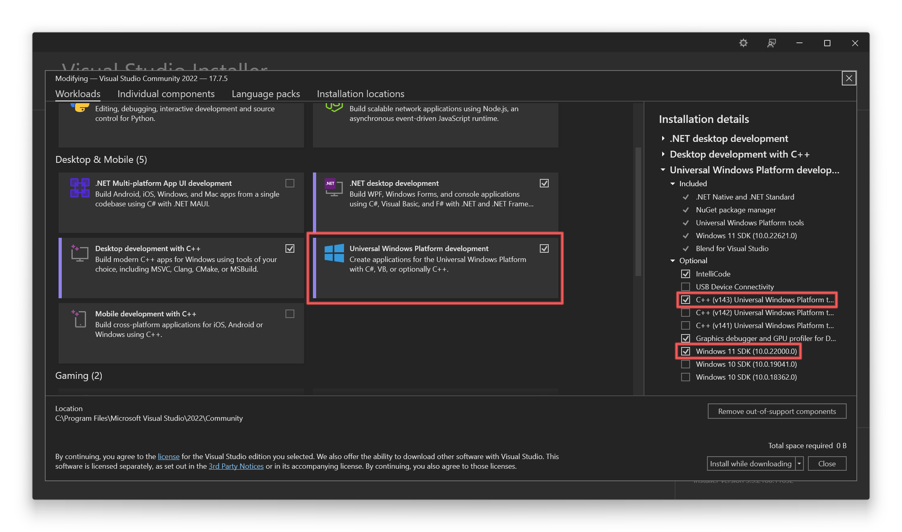

# Calculator
The Windows Calculator app is a modern Windows app written in C++ that ships pre-installed with Windows.
The app provides standard, scientific, and programmer calculator functionality, as well as a set of converters between various units of measurement and currencies.

Calculator ships regularly with new features and bug fixes. You can get the latest version of Calculator in the [Microsoft Store](https://www.microsoft.com/store/apps/9WZDNCRFHVN5).

[](https://dev.azure.com/ms/calculator/_build/latest?definitionId=57&branchName=master)

  

## Features
- Standard Calculator functionality which offers basic operations and evaluates commands immediately as they are entered.
- Scientific Calculator functionality which offers expanded operations and evaluates commands using order of operations.
- Programmer Calculator functionality which offers common mathematical operations for developers including conversion between common bases.
- Date Calculation functionality which offers the difference between two dates, as well as the ability to add/subtract years, months and/or days to/from a given input date.
- Calculation history and memory capabilities.
- Conversion between many units of measurement.
- Currency conversion based on data retrieved from [Bing](https://www.bing.com).
- [Infinite precision](https://en.wikipedia.org/wiki/Arbitrary-precision_arithmetic) for basic
  arithmetic operations (addition, subtraction, multiplication, division) so that calculations
  never lose precision.

## Getting started
Prerequisites:
- Your computer must be running Windows 10, version 1803 or newer.
- Install the latest version of [Visual Studio](https://developer.microsoft.com/en-us/windows/downloads) (the free community edition is sufficient).
  - Install the "Universal Windows Platform Development" workload.
  - Install the optional "C++ Universal Windows Platform tools" component.
  - Install the latest Windows 10 SDK.

  
- Install the [XAML Styler](https://marketplace.visualstudio.com/items?itemName=TeamXavalon.XAMLStyler) Visual Studio extension.

- Get the code:
    ```
    git clone https://github.com/Microsoft/calculator.git
    ```

- Open [src\Calculator.sln](/src/Calculator.sln) in Visual Studio to build and run the Calculator app.
- For a general description of the Calculator project architecture see [ApplicationArchitecture.md](docs/ApplicationArchitecture.md).
- To run the UI Tests, you need to make sure that
  [Windows Application Driver (WinAppDriver)](https://github.com/microsoft/WinAppDriver/releases/latest)
  is installed.

## Contributing
Want to contribute? The team encourages community feedback and contributions. Please follow our [contributing guidelines](CONTRIBUTING.md).

If Calculator is not working properly, please file a report in the [Feedback Hub](https://insider.windows.com/en-us/fb/?contextid=130).
We also welcome [issues submitted on GitHub](https://github.com/Microsoft/calculator/issues).

## Roadmap
For information regarding Windows Calculator plans and release schedule, please see the [Windows Calculator Roadmap](docs/Roadmap.md).

### Graphing Mode
Adding graphing calculator functionality [is on the project roadmap](https://github.com/Microsoft/calculator/issues/338) and we hope that this project can create a great end-user experience around graphing. To that end, the UI from the official in-box Windows Calculator is currently part of this repository, although the proprietary Microsoft-built graphing engine, which also drives graphing in Microsoft Mathematics and OneNote, is not. Community members can still be involved in the creation of the UI, however developer builds will not have graphing functionality due to the use of a [mock implementation of the engine](/src/GraphingImpl/Mocks) built on top of a
[common graphing API](/src/GraphingInterfaces).

## Diagnostic Data
This project collects usage data and sends it to Microsoft to help improve our products and services.
Read our [privacy statement](https://go.microsoft.com/fwlink/?LinkId=521839) to learn more.
Diagnostic data is disabled in development builds by default, and can be enabled with the `SEND_DIAGNOSTICS`
build flag.

## Currency Converter
Windows Calculator includes a currency converter feature that uses mock data in developer builds. The data that
Microsoft uses for the currency converter feature (e.g., in the retail version of the application) is not licensed
for your use. The mock data will be clearly identifiable as it references planets instead of countries,
and remains static regardless of selected inputs.

## Reporting Security Issues
Please refer to [SECURITY.md](./SECURITY.md).

## License
Copyright (c) Microsoft Corporation. All rights reserved.

Licensed under the [MIT License](./LICENSE).
